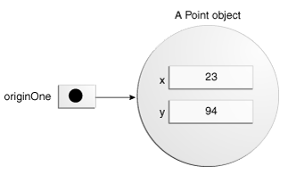

# [Objetos](#objects)

##[Creación de objetos](#creating-objects)

Existen tres partes en la sentencia de declaración y creación de un objeto:

- <b>Declaración: </b>Indica la creación de una variable y el tipo de objeto a almacenar.
- <b>Instanciación: </b>El operador `new` crea el objeto.
- <b>Inicialización: </b>Después del operador `new` se llama al constructor, que inicializa el objeto.

### [Declaración de variables para referenciar un Objeto](#declaring-a-variable-to-refer-to-an-object)

Para la declaración de una variable:

```java
tipo nombre
```

Por ejemplo:

```java
Point originOne;
```

En este ejemplo la variable no crea ningún objeto. Para ello se debe usar el operador `new` y asignar el valor del objeto creado.

En esta situación la variable `originOne` apunta a nada.

### [Instanciando una clase](#instantiating-a-class)

El operador `new` crea una instancia de una clase,  reservando memoria para un nuevo objeto y devolviendo una referencia al espacio de memoria creado. Además, el operador `new` invoca al constructor del objeto

```java
Point originOne = new Point(23, 94);
```

La referencia obtenida por el operador `new` no necesariamente tiene que ser asignada a una variable, incluso puede usarse para rescatar un valor.

```java
int height = new Rectangle().height;
```

### [Inicializando un objeto](#initializing-an-object)

Supongamos que tenemos la clase `Point` de la cual creamos un objeto y los asignamos a alguna variable:

```java
Point originOne = new Point(23, 94);
```

Lo que en realidad sucede es que el constructor inicializa los valores del objeto `Point` creado en memoria y la variable `originOne` apunta a la dirección de memoria creada.



Si tuviesemos otra clase, `Rectangle` que tomase como parámetros en su constructor un objeto de otra clase, por ejemplo la clase `Punto`, e inicialize los valores de sus miembros al objeto creado realmente se estaría apuntando solamente a la dirección de memoria original.

```java
Rectangle rectOne = new Rectangle(originOne, 100, 200);
```


## [Uso de objetos](#using-objects)

### [Referenciar a los campos de un objeto](#referencing-an-objects-field)

Los campos de un objeto son accedidos a traves de su nombre.

Si estamos dentro de la clase podemos acceder a los campos llamándolos por su nombre:

```java
System.out.println("Width and height are: " + width + ", " + height);
```

Fuera de la clase, usaremos la siguiente notación:

```java
objectReference.fieldName
```

Es decir, podremos acceder a los campos del objeto a traves de su referencia y con el operador `.`.

```java
System.out.println("Width of rectOne: "  + rectOne.width);
System.out.println("Height of rectOne: " + rectOne.height);
```

También es posible acceder a un campo sin guardar una referencia:

```java
int height = new Rectangle().height;
```

<b>Nota: </b> Al no guardar una referencia a la instancia, cuando termine la asignación en el ejemplo la `Máquina Virtual de Java` liberará el espacio de memoria que fue creado al usar el operador `new`.

### [Llamando a los métodos de un objeto](#calling-an-objects-methods)

Es posible llamar a los métodos de un objeto a traves de una referencia a este y con el operador `.`:

```java
objectReference.methodName(argumentList);
```

o:

```java
objectReference.methodName();
```

Usando el ejemplo de la clase `Rectangle` con el objeto `rectOne`:

```java
System.out.println("Area of rectOne: " + rectOne.getArea());
...
rectTwo.move(40, 72);
```

De la misma forma que los campos, es posible acceder a un método sin guardar una referencia:

```java
int areaOfRectangle = new Rectangle(100, 50).getArea();
```

### [El recolector de basura o Garbage Collector](#garbage-collector)

En algunos lenguajes es necesaria la gestión de memoria al momento de crear objetos. En java la memoria es gestionada automáticamente por lo que no es necesario preocuparse por esta.

Cuando el entorno de ejecución de java encuentra un objeto que no va a ser usado jamás, éste lo elimina, a este proceso se le conoce como `garbage collection`.

Los objetos elegidos para este proceso son:

- Objetos que no presentan ninguna referencia.
- Objetos que poseían referencias en variables, pero que estas fueron eliminadas (al salir de algún bloque o método, por ejemplo).
- Objetos que poseían una referencia en alguna variable y que la referencia fue quitada (asignando `null` por ejemplo).
